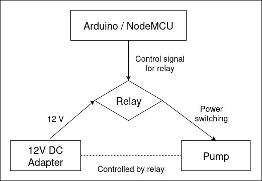
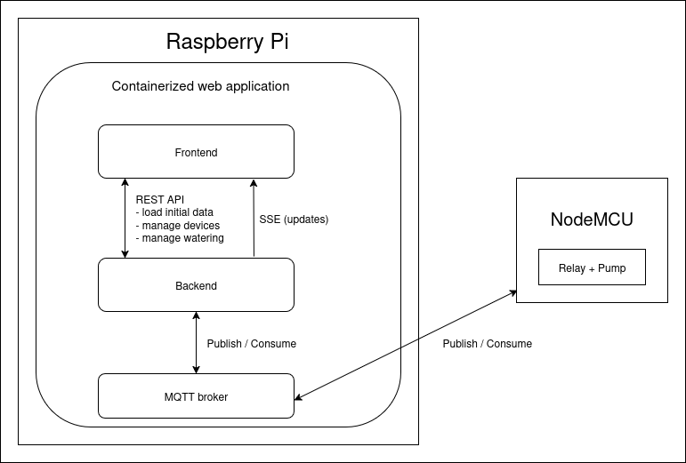
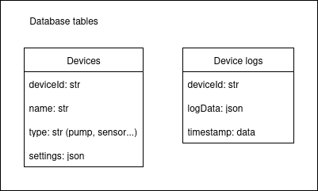
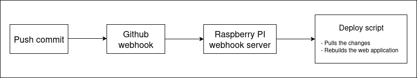
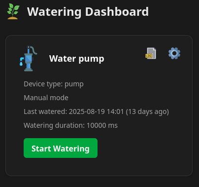

# Making a terrace watering system - overview

## Introduction

Having a terrace watering system is probably more of a statement than a practicality. Few pots or raised beds of vegetables won't feed you over the year but they can feel like a small act of resistance against mass-produced non-organic food that we encounter everyday. Furthermore, there's something special in harvesting your own food, even if this means stepping on the terrace and picking few ripe cherry tomatoes. But no matter how small the garden is, to make it happen, some nurturing must be provided and this includes regular watering. Also, garden isn't only about effort - it's about continuity - being away from it for a week or two during the summer could have devastating effect on the plants. The simplest solution for this problem could be a friendly neighbour who's not away. But let's say that this option isn't always available. Enter IoT and watering automation.

The mentioned situation was the catalyst for this project although I considered it before the 'problem' came to existence. Immediately after I got my first Raspberry Pi, watering automation was one of the 'archetypal' Pi projects that got my attention. I liked the idea of coding to control something physical, it felt for me a bit like magic. And as I was still figuring out how to do it I got small donation of parts that could be used for watering that would otherwise be sitting in a box, gathering dust in the basement. Among them were Arduino Uno and NodeMCU ESP8266 boards, YL69 moisture sensors, relay, solenoid valve and water pump. Until that moment I didn't really consider using Arduino, but now that I had it, new idea emerged - Raspberry Pi will host web application that will serve as a dashboard for wireless control over Arduino-relay-pump watering system. Also, I had a time frame - I decided to try to make it in about a month, so I can use it during vacation.

## Gathering ideas and implementation
Since I was going to use what I had, first step was straightforward - I needed to investigate how to wire Arduino with sensor and with pump and relay to see if the electronic parts work. This was fairly simple and everything worked fine. Arduino only needs to control the current that goes to pump via relay and I needed to use 12V DC adapter because pump demanded that much power.

*High-level diagram showing how arduino works with relay and the pump*

The code on Arduino needed to wait after I decide on communication with the web server. So I started thinking about web server. I came up with the following idea:

*High-level diagram showing communication between frontend, backend and pump*

*Data that will be stored in the database and shown on the dashboard*

1. Service will store devices (with settings) and device logs
2. Frontend will show this information per device in cards. There will be access to device settings and logs and automatic/manual control over watering
3. Events will be used as a way of communication between devices and web server (e.g. watering command will be sent to some topic, pump will consume it and in different direction - if the watering starts or ends, pump will publish event that will be then consumed by web server)
4. REST API will be used to load data to frontend, but server sent events will be used to dynamically update it (e.g. when watering is done frontend can show notification about it immediately and refetch latest logs)

I wanted to make the initial setup and updates of the application quick and easy so I came up with some 'light' devOps ideas:

- Web server should run in container
- There will be a script that will install dependencies and run the server so the setup is as simple as possible
- There will be simple CD (continuous delivery) flow, so when new commit is pushed to repository the application is redeployed with the newest changes

*Diagram for CD flow on Raspberry Pi*

Initial idea proved to be overwhelming - it was too much to do all at once. Also it was over-engineering something that could be simple. So I decided to make the server that will communicate via serial port with Arduino. Eventually, I had some kind of MVP that was starting pump by clicking button on frontend. But afterwards I decided not to keep Raspberry Pi on the terrace connected via USB with pump because of the high temperature. So I gradually built towards initial idea. I decided to treat the whole thing as playground - although I didn't need to make things scalable and automated, it was a way to practice new skills and learn something. The web server part is still work in progress and it will probably stay that way - but I got to the point where I can check most of the initial idea 'boxes' (SSE communication is still TODO).

On the other hand, some ideas that I had in the process proved to be dead ends. I gave up from some features/improvements that I wanted to include:

- From the start I had an idea to monitor the moisture of the soil and to make the system 'smart' so the watering starts when moisture drops. The idea was to use battery-powered Node MCU connected with sensor to periodically send data about plant moisture. But this proved to be useless because readings were unreliable, it even appeared as if moisture increases over time. I also found out that commercial solutions don't rely on moisture sensors - sometimes sensors are used to check if it was raining to skip the watering -  but the main thing is that they have timers to define watering interval.
- I intended to use solenoid valves to control watering of specific plant groups. For example, to water only peppers or tomatoes if sensors or experience shows that one plant group needs more water. But I dropped it because it seemed like an overkill for terrace garden with less than 20 plants. Additional complication was that the valve that I got was made for incompatible hose diameter (1/4", while pump was using 8mm ID).
- When I decided have wireless communication between Raspberry and pump, I tried running server on pump-controlling Node MCU and use REST API to start watering. But both setting static IP on the pump device and using magic DNS seemed complicated and less reliable than using event-based system. I actually left possibility to use different communication strategies (serial, wifi, event-based) for pump, but my choice was the latter.

Although the web app was ready for some time, I was able to make the watering work only few days before vacation because I was waiting for hoses and hose splitters. Somewhat unexpectedly, smaller diameter hoses were hard to get delivered on short notice. However, I did it. It worked great 8)

*Dashboard showing the pump with pump device*

## Further thoughts

Since I'm web developer, creating the web application for remote control of the watering system was the most interesting part for me, or at least the part in which I was most involved. I was trying some ideas and made the solution more complicated than it needed to be - I really didn't need to make things modular/scalable and to support more pumps and sensors because I only intended to use one pump. But, as I already mentioned, that was for the sake of learning and trying. For someone looking for simplicity - in this kind of project Raspberry Pi could be omitted completely. In this scenario Arduino itself would control the pump, watering would be done in predefined interval and between waterings the system would go to sleep. This is maybe the most economic solution. It also can be improved by adding some buttons and LED display to set the timer. If one still opts for some kind of centralized server, there are ready-made solutions for that also (Home Assistant). But reinventing the wheel was kind of the point here.

And now, a moment of candor - this project wasn't done only by myself as I used ChatGPT to generate some code and to speed up a process of development. In the background of this help stands the work of other people on the web, and using it maybe shouldn't feel different then (e.g.) using Stack Overflow. But it feels different. So, despite idea, architecture and tech-stack decisions are mine, I feel a bit uneasy because of using AI and want to elaborate on this a bit. Using ChatGPT made me quicker - I probably wouldn't made this by deadline without it. That's fine, but uneasy part comes from potential passivity that comes along with using these kind of tools. For example, I deliberately chose to use some libraries that I don't use often and this was also slowing me down. Then I tried to speed up the process by getting some code from ChatGPT. The question arises what's the point of trying something new if there's no effort.

I like to think that I wasn't that passive in the process - I was debugging, rewriting some code, thinking about alternatives and so on. As for new technologies/libraries, I was exposed to something new in a hands-on way and this should help in my further using of these things. But I strongly believe that one shouldn't skip documentation and 'digging'. Coding by myself first (but not hesitating to use available tools) is the way I think that I will learn the most while retaining the sense of authenticity and pride in my work. So further steps for me in this project could be to digest and refactor the code that I didn't write directly and make improvements without the aid. Some 'side-goals' emerged while working on this project. These include making production-ready backend and frontend templates and frontend component library that I could use in future projects. This could save me time in setting things up and help me concentrate on the main idea. While working on these I can maybe practice the mentioned approach.

## Conclusion

There are commercial automated watering solutions that are affordable, but making this project wasn't just about watering. Like a small terrace garden, it's probably more of a statement in a world of ready-made solutions. Also, a little bit of DIY can feel empowering, teach a new skill or knowledge, it can provide joy of making something that works and so on. The water pump works and there are lots of things that I could improve. I'll probably do something from time to time, but initial goal was done. It's great to see that it works, although the whole thing seems too complicated. It's because of this (unnecessary) complexity that I feel ambiguous towards home automation. I wouldn't say that it can't get practical, but in case you need to get some plants watered during the vacation I would still recommend to put some faith in thy friendly neighbour :)

## Further reading - TODO
- include links to other parts of the repo
