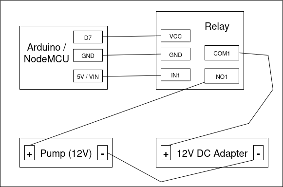
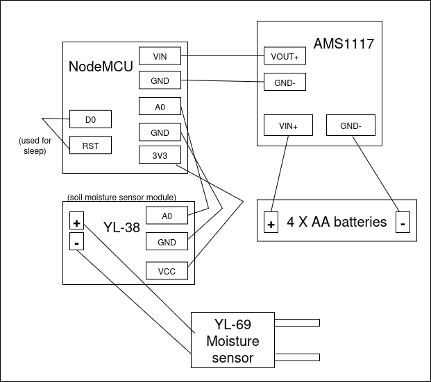

# Watering system schemas

## Contents
1. [Arduino controlled pump](#arduino-controlled-pump)
2. [Moisture sensor](#moisture-sensor)
3. [Hose organization](#hose-organization)

## Arduino controlled pump

### How it works
1. Arduino sends 'control' signal (HIGH/LOW) to the relay
2. Depending on the state, relay will either open or close the circuit
3. Circuit is formed with 12V DC adapter, relay and 12V pump
4. Pump will work when electricity flows

### Assembly

Connect:

- Arduino D7 (digital input of choice) - Relay IN1
- Arduino GND - Relay GND
- Arduino 5V (in case of NodeMCU - VIN) - Relay VCC
- Relay COM1 - 12V DC Adapter +
- Relay NO1 - Pump +
- 12V DC Adapter - to Pump -

## Moisture sensor
From the start I had an idea to monitor the moisture of the soil and to make the system 'smart' so the watering starts when moisture drops. The idea was to use battery-powered Node MCU connected with sensor to periodically send data about plant moisture. But this proved to be useless because **readings were unreliable**, it even appeared as if moisture increases over time. I also found out that commercial solutions don't rely on moisture sensors - sometimes sensors are used to check if it was raining to skip the watering -  but the main thing is that they have timers to define watering interval.

However, I'll add here things needed and diagram for assembly of battery powered NodeMCU with moisture sensor if you want to try it.

### Parts needed

- NodeMCU
- AMS1117 linear voltage regulator
- Casing for 4 AA batteries + batteries
- YL-69 sensor (with YL-38 module - it usually comes together)

### Assembly

Connect:

- NodeMCU GND - AMS1117 GND-
- NodeMCU VIN - AMS1117 VOUT+
- AMS1117 VIN+ - Batteries +
- AMS1117 GND- - Batteries -
- NodeMCU GND - YL-38 GND
- NodeMCU A0 - YL-38 A0
- NodeMCU 3V3 - YL-38 VCC
- YL-38 + and YL-38 - to YL-69 (+/- aren't marked on the sensor, it doesn't matter which side)
- NodeMCU D0 - NodeMCU RST (ensures sleed)

To send periodically readings to web-server with REST-API, use [this code](../arduino/sensors/moisture-sensor.cpp).

## Hose organization
When the electronics part is ready, you need to connect the hoses and ensure that you really water your plants. I used submersible pump but I didn't soak it in the water because I didn't isolate the wires completely. If you put submersible pump outside of the water source, you need to suck the water into the hose to the pump or otherwise pump won't work. Be careful not to run pump dry as this can damage the pump.

So the general idea is:
1. Connect the wider diameter hose (in my case 8mm ID / 11mm OD) that will pump out the water to the pump and put in the bucket full of water; ensure that it is secured so the end stays on the bottom
2. On the other side wider diameter hose will form the 'main' watering line. It should be connected to splitters that will then provide water to smaller diamater hoses. I needed to peel off the edges becase splitters were meant for 10mm OD hoses but it worked
3. Connect smaller diameter hoses (4mm ID / 6mm OD) to the splitters on one end, and put the in the pots on the other.
4. Last splitter will spill the water if the main line connector isn't closed. One way to do it is to connect short part of the hose on the end and then tie the hose.

