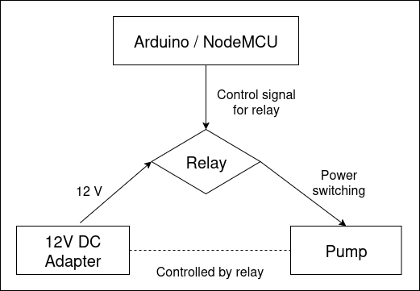

# Watering system schemas

## Arduino controlled pump

### How it works
1. Arduino sends 'control' signal (HIGH/LOW) to the relay
2. Depending on the state, relay will either open or close the circuit
3. Circuit is formed with 12V DC adapter, relay and 12V pump
4. Pump will work when electricity flows

### Assembly - TODO
- add detailed diagram how to connect all the parts

## Moisture sensor - TODO
- add diagram for Sensor with NodeMCU on batteries with deep sleep
- elaborate why this isn't a good option

## Hose organization
When the electronics part is ready, you need to connect the hoses and ensure that you really water your plants. I used submersible pump but I didn't soak it in the water because I didn't isolate the wires completely. If you put submersible pump outside of the water source, you need to suck the water into the hose to the pump or otherwise pump won't work. Be careful not to run pump dry as this can damage the pump.

So the general idea is:
1. Connect the wider diameter hose (in my case 8mm ID / 11mm OD) that will pump out the water to the pump and put in the bucket full of water; ensure that it is secured so the end stays on the bottom
2. On the other side wider diameter hose will form the 'main' watering line. It should be connected to splitters that will then provide water to smaller diamater hoses. I needed to peel off the edges becase splitters were meant for 10mm OD hoses but it worked
3. Connect smaller diameter hoses (4mm ID / 6mm OD) to the splitters on one end, and put the in the pots on the other.
4. Last splitter will spill the water if the main line connector isn't closed. One way to do it is to connect short part of the hose on the end and then tie the hose.

